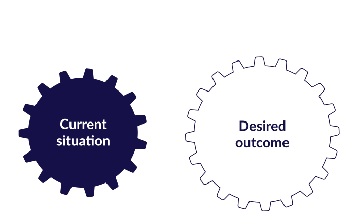

# employee_promotion_recommender

     
  
 # Problem statement: 

A machine learning model to determine whether an employee is due for promotion  based on the HR metrics

# Objective: 

The company has hired you to help out in identifying the eligible candidates at a specific checkpoint, so as to help them expedite the whole promotion process. The company has provided multiple data points around the staff’s past and present performance, together with some demographics. Predict whether a candidate within the promotion pipeline should be promoted or not. 
  
# Description
- optimization of each of the the above models to Identify the best model, and used the best model to determine which features are most impactful in influencing the prediction

### Solution 1: XGBoost

### Solution 2:LightGBM 

### Solution 3:CatBoost

# Data Features

### Dataset

The [dataset](https://drive.google.com/drive/folders/1DtDYBME3bKQaC3VKQ3hzDNfoKoj4J7BZ?usp=sharing) has the following features:

**Column:**	Description

**employee_id:**  Unique ID for employee

**department:**  Department of employee

**region:**  Region of employment (unordered)

**education:** Education Level

**gender:** Gender of Employee

**recruitment_channel:** Channel of recruitment for employee

**no_of_trainings:** number of other trainings completed in previous year

**age:** Age of Employee

**previous_year_rating:** Employee Rating for the previous year

**length_of_service:** Length of service in years

**KPIs_met >80%:** if KPIs >80% then 1 else 0

**awards_won?:** if awards won during previous year then 1 else 0

**avg_training_score:** Average score in current training evaluations

**is_promoted	(Target):** Recommended for promotion

# Context

   
A Kenyan company, Simba Deliveries, has 9 departments across the company. The company HR department usually has a hard task identifying the right staff to be considered for various promotions within the company. The promotions are usually only for the manager position and below. The current process they are following is:

1.	Identify the set of staff liable for promotion based on past performance or recommendations
2.	Chosen staff are taken through separate trainings programs and evaluations based on the skills that are required
3.	In light of different factors such as program and training performance, KPI completion (only employees with KPIs > 80% are considered) and such, the chosen staff are considered for promotion.

Given the long procedure for evaluation of a promotion candidate, there are huge delays in facilitating the transition to their new roles.

   
  procedure used for obtaining data:
 
 (https://jumakeya2019.atlassian.net/secure/RapidBoard.jspa?rapidView=4&projectKey=SKP&modal=detail&selectedIssue=SKP-18)
  

# Requirements

* Anaconda installation
* Google colab
* Setup instruction
> * Save a copy of the notebook in your drive and open it to access.

   
   # Technologies used:
   
 
 
   
  
 

# Support
In case of any clarifications or suggestions with regards to this project email us at the following email addresses:
- jumakeya@gmail.com
- elizangandu97@gmail.com
- colorotich@gmail.com
-  sarahlaura1428@gmail.com

License
Copyright (c) 2020 **Abel Keya**
